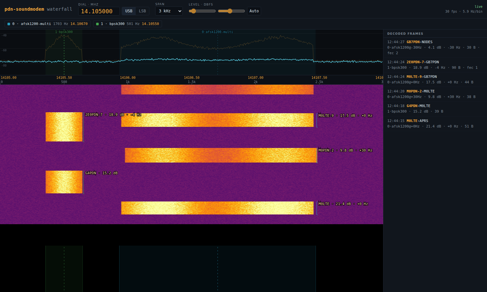

# Your first station

At the end of this page one AFSK 1200 modem is decoding packet off air, the frames are on the station page in your browser, and your node or APRS software is attached to it over KISS. One path is described: VHF FM on the APRS calling frequency, which is the quickest way to a first decode because the band is busy and nobody has to answer you.

## Before you start

- pdn-soundmodem installed, from [01-install.md](01-install.md).
- An FM radio tuned to the APRS frequency for your country, 144.800 MHz across Europe and 144.390 MHz in North America, with its volume up enough to feed the sound card.
- A USB sound card or a CM108-class radio interface wired to the radio's receive audio, transmit audio and PTT; [03-radios-and-interfaces.md](03-radios-and-interfaces.md) covers choosing and wiring one.
- Root on the machine.

If you have no radio to hand, skip to [No radio to hand](#no-radio-to-hand) and replay a recording instead.

## Find the sound card

List what the machine can record from:

```sh
arecord -l
```

```
**** List of CAPTURE Hardware Devices ****
card 1: Device [USB Audio Device], device 0: USB Audio [USB Audio]
  Subdevices: 1/1
  Subdevice #0: subdevice #0
```

The word before the brackets, `Device` here, is the card's ALSA name; the brackets hold its longer description. Now ask for the full device strings:

```sh
aplay -L
```

```
plughw:CARD=Device,DEV=0
    USB Audio Device, USB Audio
    Hardware device with all software conversions
```

The real list is longer, with the machine's own outputs in it (`Headphones` and `vc4hdmi0` on a Pi), so pick the entry whose second line names your USB card. Write that `plughw:CARD=<name>,DEV=0` form down. It names the card rather than its number, and card numbers move when you plug something else in, so a station configured as `plughw:1,0` can come up on the wrong card after a reboot.

## Choose the PTT line

pdn-soundmodem keys the radio one of two common ways, and you write one small block in the config for whichever you have.

Serial, where a USB serial adapter's RTS line drives the radio's PTT:

```json
"ptt": { "type": "serial", "device": "/dev/ttyUSB0" }
```

CM108, where a GPIO pin on the radio interface itself drives the PTT:

```json
"ptt": { "type": "cm108", "device": "/dev/hidraw0" }
```

Serial needs nothing extra, because the service user is already in the `dialout` group. CM108 does: `/dev/hidraw*` is root-only by default. Find your interface's USB IDs with `lsusb` (`0d8c:0012` is a common C-Media one), then write a udev rule with your own IDs in place of those:

```sh
sudo tee /etc/udev/rules.d/99-pdn-soundmodem-cm108.rules >/dev/null <<'EOF'
KERNEL=="hidraw*", ATTRS{idVendor}=="0d8c", ATTRS{idProduct}=="0012", MODE="0660", GROUP="audio"
EOF
sudo udevadm control --reload-rules && sudo udevadm trigger
```

`udevadm trigger` applies the rule to what is already plugged in, so `ls -l /dev/hidraw*` should show group `audio` straight away. If it still says `root root`, unplug the interface and plug it back in.

## Write the config

Open `/etc/pdn-soundmodem/soundmodem.json` as root (`sudo nano` on Raspberry Pi OS and Ubuntu, `sudo vi` on a minimal Debian) and replace what is there with six lines, using your card and your PTT block:

```json
{
  "device": "plughw:CARD=Device,DEV=0",
  "modems": [ { "subChannel": 0, "mode": "afsk1200" } ],
  "ptt": { "type": "cm108", "device": "/dev/hidraw0" },
  "waterfall": { "port": 8107 }
}
```

`device` is the sound card. `modems` is the list of modems sharing that audio; this one has a single AFSK 1200 modem on sub-channel 0, which is the number your node or APRS software uses to address it. `waterfall` serves the station page on port 8107. Every key, with its default, is in the [configuration reference](reference/config.md#top-level-keys).

The page and the KISS port listen on loopback only, so at this point you can reach them from the machine itself and nowhere else. To open them to your own network, add `"bind": "*"` at the top level. The station page has no password and carries a transmit test, and KISS has no authentication, so read [06-connect-your-software.md](06-connect-your-software.md#who-can-reach-these-ports) before you do.

## Restart and read the journal

```sh
sudo systemctl restart pdn-soundmodem
journalctl -u pdn-soundmodem -f
```

Among the start-up lines, in this order and with others between them, you should see something like this (the buffer and period are whatever the card agreed to):

```
pdn-soundmodem 0.69.0, commit 1cd85706f54a5bf84546dd2fbb04467992cdfcab
config: /etc/pdn-soundmodem/soundmodem.json
modem 0: afsk1200
waterfall: http://127.0.0.1:8107/
kiss tcp: 127.0.0.1:8105 (all modems, by sub-channel nibble)
ptt: cm108 /dev/hidraw0 (gpio 3)
audio: plughw:CARD=Device,DEV=0 capture 48000 Hz -> 12000 Hz
audio: capture buffer 500 ms, period 30 ms
```

Then wait. On 144.800 the first decode usually arrives inside a few minutes, and it looks like this:

```
rx[0] afsk1200 M0LTE>APRS 55 bytes
```

Received, on sub-channel 0, in `afsk1200`, from `M0LTE` to `APRS`, 55 bytes long. Once the modem has measured the band noise the line gains `snr 72.6 dB`, the strength of the burst the frame rode in on. Other modes add a measured frequency offset and a count of bytes the FEC corrected; [12-troubleshooting.md](12-troubleshooting.md) reads every field.

## Open the station page

Point a browser at `http://127.0.0.1:8107/` on the machine itself, or at `http://<the machine>:8107/` if you set `"bind": "*"`.



An HF station with two modems. Yours shows one chip, with a KISS badge after it.

You should see a spectrum with a waterfall scrolling beneath it, one chip reading `AFSK1200` and `KISS 8105, no host`, and a Decoded frames panel that says `Nothing decoded yet.` until the first frame arrives. Each burst on the waterfall gets a tag with the callsign that sent it.

If frames arrive carrying a `TOO LOUD` or `TOO QUIET` badge, the receive audio needs adjusting. That is [04-levels.md](04-levels.md), and it is the next thing to do once you are decoding at all. Every other control and badge on the page is in [07-station-page.md](07-station-page.md).

## Connect your node or APRS software

The modem is already serving KISS over TCP on port 8105. Check that it accepts a connection, and watch the journal answer:

```sh
nc 127.0.0.1 8105
```

```
kiss[8105] 127.0.0.1:50926 connected - 1 client (all modems)
```

Press Ctrl-C and a matching `disconnected` line follows. Now point the real software at the same host and port. LinBPQ, the PDN node, APRS clients and Winlink each want their own settings, and [06-connect-your-software.md](06-connect-your-software.md) has a recipe for each.

## Check it worked

The journal shows `rx[0] afsk1200` lines arriving, the station page lists the same frames, the chip says `KISS 8105: 1 host` once your software is attached, and that software starts listing the stations it has heard.

## If it did not

- `cannot open the sound device` with `No such device`: the `device` string does not match this machine. Run `aplay -L` again and copy the `plughw:CARD=...,DEV=0` line as printed.
- `cannot open the cm108 PTT device` with `Access to the path '/dev/hidraw0' is denied.`: the udev rule is missing or has the wrong USB IDs. Check them with `lsusb`, fix the rule, reload, replug.
- The service stays up but no `rx` lines ever appear: audio is not reaching the card, or is reaching it at the wrong level. Turn the radio's volume up, open the squelch, then work through [04-levels.md](04-levels.md).

Anything else is in [12-troubleshooting.md](12-troubleshooting.md).

## No radio to hand

A recording can stand in for the radio. The `.deb` does not ship the recordings, so this needs a checkout of the source:

```sh
sudo apt install git
git clone https://github.com/packet-net/pdn-soundmodem
cd pdn-soundmodem
sudo systemctl stop pdn-soundmodem
pdn-soundmodem --wav-loop samples/demo/01-afsk1200-aprs-position.wav --modem 0:afsk1200 --kiss 8105 --waterfall 8107
```

`--wav-loop` replays the file forever at the pace the radio would have delivered it, and the whole station runs with no sound card and no PTT. The APRS position frame in the file decodes about once a second:

```
audio: wav-loop samples/demo/01-afsk1200-aprs-position.wav 48000 Hz -> 12000 Hz
rx[0] afsk1200 M0LTE>APRS 55 bytes
```

Open `http://127.0.0.1:8107/` to watch the waterfall and the frames panel behave as they would on air. Stop it with Ctrl-C. The other recordings, one per mode, are listed in [samples/demo/README.md](../samples/demo/README.md).

## Related

- [04-levels.md](04-levels.md) is the next page, and the one that turns an occasional decode into a reliable one.
- [06-connect-your-software.md](06-connect-your-software.md) for LinBPQ, APRS clients and Winlink.
- [05-modes.md](05-modes.md) for what else this station could run on the same sound card.
- [reference/config.md](reference/config.md) for every configuration key.
