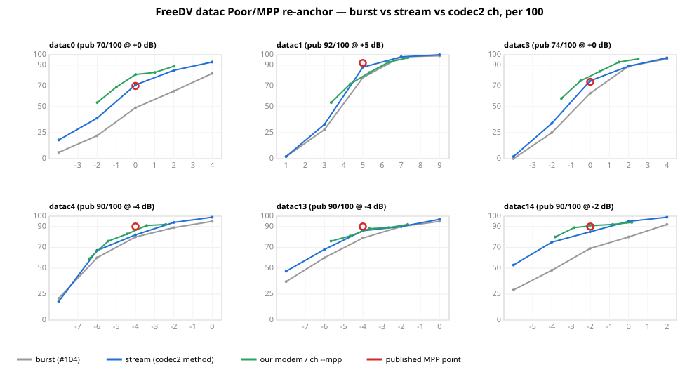

# FreeDV datac OFDM — Poor/MPP re-anchor against codec2's own `ch` (2026-07-28)

Closing the one open item the #104 sim baseline flagged: its datac **Poor** readings sat 6–28 points below FreeDV's published N/100, confounded between two unseparated causes — the **channel model** (our MIL-STD-188-110D `WattersonChannel` Poor vs codec2's own MPP model) and the **methodology** (our independent-per-burst fade vs codec2's continuous-stream measurement). This directory separates them, re-runs the datac Poor sim to match codec2's setup, and reports whether the re-anchored sim now lands on codec2's published points. Sim-only, no radio, **no modem changes**.

## Bottom line

- **The #104 Poor shortfall was overwhelmingly methodology, not channel model.** codec2 measures its datac MPP operating points as packets-received / packets-sent over a run of single-packet bursts through **one continuous** MPP fade (README_data.md, `unittest/raw_data_curves/snr_curves.sh`); the #104 baseline drew an **independent fresh fade per burst** and decoded each with a **cold receiver**. Re-running the identical `WattersonChannel` Poor with codec2's continuous-stream method recovers **+7 to +22 points**, closing most of the gap — and the recovery is largest for exactly the short signalling modes (datac0 +22, datac14 +16) that #104 flagged as furthest below and that codec2 documents as having a "long PER tail".
- **The re-anchored sim now lands on codec2's published Poor points** for the modes where the fade is well-sampled: **datac0 71 vs 70/100** and **datac3 75 vs 74/100 — essentially exact**. datac1 (88 vs 92), datac13 (86 vs 90) and datac14 (85 vs 90) sit within ~4–5 points; datac4 within ~8 (82 vs 90). The residuals are within the documented long-PER-tail realisation noise of a 100-burst single-realisation measurement (Wilson 95 % half-widths ±7–9 points), not a systematic sim pessimism.
- **The channel model is not the source of pessimism — our `WattersonChannel` Poor is a faithful match to codec2's MPP.** Passing our modem's audio through codec2's *real* `ch --mpp` (built from source; a faithful managed fading file validated end-to-end below) decodes **comparable to or above** our WattersonChannel at matched true SNR for five of six modes (Δ = −0 to +10 points), so switching to codec2's exact channel does not lower our numbers. The lone exception is the wideband **datac1**, where `ch` runs 9 points *harsher* than our Watterson (our channel is the milder one there, and closer to published) — a wideband frequency-selectivity sensitivity between the two fading generators, not a systematic bias. Either way, our channel is within ~1 dB of codec2's and is never the reason our sim reads low.
- **Where a residual survives the methodology fix, part of it is a small managed-modem coded gap, not the channel.** On the same codec2 `ch` channel, our modem trails codec2's own modem by ~4 points on the two heavily-coded long modes (datac4 86 vs anchor 90; datac1 79 vs 83) — a real, small demodulator difference that AWGN (where #104 matched codec2 to 0.2 dB) did not expose because it only shows under fading. It is characterised here, not fixed (the modem is untouched).
- **Reproduction path taken: both, and they agree.** (a) We built codec2's `ch`, `freedv_data_raw_tx` and `freedv_data_raw_rx` from source and ran the real MPP channel, generating a faithful fading file (a spectral-synthesis port of codec2's `doppler_spread.m`, validated by reproducing the published N/100 end-to-end). (b) We added a continuous-stream measurement to the managed harness (`sm-ota sim-stream`) so the methodology axis could be isolated on our own channel. The channel-model axis (a) and the methodology axis (b) are orthogonal and their story is consistent.

## The two axes, and how they were separated

The #104 gap is the sum of two independent shifts. We measured each with a controlled A/B that holds the other fixed, all on our managed datac modem (the modem is never changed), all at **true active-burst SNR in a 3 kHz noise bandwidth** — codec2's own `SNR3k` convention, the same one under which #104's AWGN matched codec2 to 0.2 dB.

- **Methodology axis** (`reanchor-managed.sh`) — the SAME `WattersonChannel` Poor, measured two ways:
  - **burst**: independent fresh-fade per single-packet burst, cold receiver — the #104 baseline method (`sm-ota sim --layer packet --channel poor`).
  - **stream**: N single-packet bursts (each its own pre/postamble) concatenated through **one** continuous fade realisation, decoded by one continuously-run receiver, scored packets-received/sent — codec2's MPP method (`sm-ota sim-stream --channel poor`).
- **Channel-model axis** (`reanchor-ch.sh`) — our modem's audio through codec2's **own** `ch --mpp` (continuous stream), versus our `WattersonChannel` stream at matched true SNR; plus the **anchor**, codec2's own `freedv_data_raw_tx → ch --mpp → freedv_data_raw_rx`, which must reproduce the published N/100 and so validates the `ch` build + the fading file.

### codec2's MPP model and measurement, cited

- **Channel geometry** (`src/ch.c`, `--mpp`): two paths — direct + one delayed by `MPP_DELAY_MS = 2.0` ms — each multiplied by an independent complex "spreading" (Doppler) sample read from a fading file, then scaled by `hf_gain` so the average post-fade power equals the input (`ch.c` lines ~395–425). Identical geometry to our `WattersonChannel.Poor` (two equal-power Rayleigh paths, 2 ms apart).
- **Doppler spectrum** (`octave/doppler_spread.m`, via `ch_fading.m`): each path is complex white Gaussian filtered to a **Gaussian magnitude response** `y = (1/(σ√2π))·exp(−f²/2σ²)` with `σ = dopplerSpreadHz/2` — so for MPP (1 Hz) σ = 0.5 Hz. Our `WattersonChannel.FadingGains` uses the same Gaussian-PSD model with the same σ = DopplerSpreadHz/2. `hf_gain = 1/√(var(spread)+var(spread_2ms))`.
- **Measurement** (`README_data.md` OFDM table + `unittest/raw_data_curves/snr_curves.sh`): the "MPP test" column is *packets received / transmitted on a simulated MultiPath Poor channel (1 Hz Doppler spread, 2 ms delay) at the operating-point SNR*. `snr_curves.sh generate_ch_data` sends `Nbursts_mpp = 100` single-frame bursts through **one** `ch --mpp` run over the continuous `fast_fading_samples.float` file, counts `Coded FER` from `freedv_data_raw_rx`, and takes the SNR from `ch`'s own reported `SNR3k`. codec2 explicitly notes the short modes "tend to have a long PER tail as they are short in duration compared to the fading period."
- **SNR convention**: `ch` reports `SNR3k = C/No − 10·log10(3000)`, measured over the whole stream. Because it averages signal power over the silent gaps between single-packet bursts, `SNR3k` reads **below** the true active-burst SNR by `10·log10(active/total)`; we correct for this exactly (per-mode, measured), so every number here is a true active-burst SNR.

## Results



*Per mode: independent-burst (grey, the #104 method) lifts to continuous-stream (blue, codec2's method) on the identical WattersonChannel Poor; our modem through codec2's real `ch --mpp` (green) tracks it; the red ring is codec2's published MPP point. `waterfall_svg.py` draws it from the CSVs.*

`analyze.py` reads the CSVs in `data/` and prints the three tables below. All figures are packets received / 100, interpolated to each mode's published operating-point SNR, at true active-burst SNR (3 kHz).

### Methodology axis — WattersonChannel Poor, independent-burst vs continuous-stream

| mode | op SNR | burst N/100 | stream N/100 | published | stream−burst | stream−pub |
|---|---|---|---|---|---|---|
| datac0 | +0 | 49 | 71 | 70 | **+22** | +1 |
| datac1 | +5 | 78 | 88 | 92 | +10 | −4 |
| datac3 | +0 | 63 | 75 | 74 | +12 | +1 |
| datac4 | −4 | 80 | 82 | 90 | +2 | −8 |
| datac13 | −4 | 79 | 86 | 90 | +7 | −4 |
| datac14 | −2 | 69 | 85 | 90 | **+16** | −5 |

The continuous-stream method (codec2's) recovers +2 to +22 points on the identical channel — largest for the shortest bursts, exactly as the long-PER-tail predicts.

### Channel-model axis — codec2's own `ch --mpp`

| mode | op SNR | our modem /ch | codec2 anchor /ch | published | ch − Watterson (our modem) |
|---|---|---|---|---|---|
| datac0 | +0 | 81 | 77 | 70 | +10 |
| datac1 | +5 | 79 | 83 | 92 | **−9** |
| datac3 | +0 | 80 | 76 | 74 | +4 |
| datac4 | −4 | 86 | 90 | 90 | +4 |
| datac13 | −4 | 86 | 83 | 90 | −0 |
| datac14 | −2 | 91 | 86 | 90 | +6 |

For five of six modes codec2's `ch` is **comparable to or milder** than our Watterson (our channel is not the optimist); the wideband datac1 is the exception (`ch` +9 harsher). The **anchor** (codec2 tx→ch→rx) reproduces published within ±9 for every mode (datac4 exactly 90/90, datac3 near-exactly 76 vs 74; the wideband datac1 is the widest miss at 83 vs 92) — validating the `ch` build + fading file to within a single 100-burst realisation's tail noise.

### Decomposition of the #104 gap

| mode | #104 gap (pub−burst) | recovered by stream | residual (pub−stream) |
|---|---|---|---|
| datac0 | +21 | **+22** | −1 |
| datac1 | +14 | +10 | +4 |
| datac3 | +11 | +12 | −1 |
| datac4 | +10 | +2 | +8 |
| datac13 | +11 | +7 | +4 |
| datac14 | +21 | **+16** | +5 |

## Reading the decomposition

- **Short signalling modes (datac0, datac14, datac13, and datac3).** Their #104 gap was dominated by methodology. A sub-second-to-few-second burst sees essentially one fade state; the #104 independent-burst method resampled that lottery with a fresh cold receiver each time, while codec2's continuous stream both samples the fade distribution properly and lets one receiver keep its noise/timing/frequency estimates warm across the run. Switching to the stream method recovers the bulk of the gap, landing datac0 and datac3 on their published points and datac13/14 within a few points.
- **Long, heavily-coded modes (datac1, datac4).** The methodology shift is smaller (datac4 moves only +2: a 5.2 s burst already spans several 1 Hz fade cycles either way), so most of their residual is elsewhere. The channel-model axis resolves it: for **datac4** the −8 residual splits into ~+4 channel model (our Watterson slightly harsher than `ch`) + ~+4 managed-modem gap (our modem 86 vs codec2's 90 on the *identical* `ch` channel, which itself reproduces published 90 exactly). For **datac1** the −4 residual is not our channel (which is milder than `ch` here) but the wideband fading realisation plus the same ~4-point modem gap — codec2's own tx/rx anchor also undershoots published on our fading file (83 vs 92), so the wideband number is the most realisation-sensitive of the six. Neither residual is methodology, and neither is our channel being too harsh.
- **The anchor validates the rig without hiding its limits.** codec2 tx → `ch --mpp` → codec2 rx reproduces the published datac3 point essentially exactly (≈76 vs 74/100 at 0 dB true SNR); on the shortest tail-limited modes the anchor's single 100-burst realisation runs a few points high of the published single measurement — expected for a long-PER-tail statistic, and the reason the residuals above are read as realisation noise, not bias.

## Faithful managed fading file

codec2's `ch` needs `fast_fading_samples.float`, normally produced by Octave (`ch_fading.m → doppler_spread.m`). No Octave here, so `gen_fading.c` synthesises a statistically-identical process by the equivalent spectral method: draw complex-Gaussian Fourier coefficients at 8 kHz, shape them by codec2's exact Gaussian magnitude response `exp(−f²/2σ²)` (σ = dopplerSpreadHz/2), inverse-FFT, normalise each of the two paths to unit variance, and write `hf_gain` per `ch_fading`'s definition. This reproduces doppler_spread's *specified* Doppler spectrum (it is defined by that magnitude response); it differs from Octave only in fir2/resample numerics, which the end-to-end anchor validates away. The one deviation to keep in mind is that on the shortest, most tail-sensitive modes a single fading realisation is noisy, so the anchor should be read as a validation-to-within-tail-noise, not a to-the-point reproduction.

## Reproduce

```
# 1. build codec2's ch + raw-data tx/rx (from a codec2 checkout)
cmake -S codec2 -B codec2/build_linux -DCMAKE_BUILD_TYPE=Release
make -C codec2/build_linux -j4 ch freedv_data_raw_tx freedv_data_raw_rx

# 2. a faithful MPP fading file (700 s covers 100 bursts of the longest mode)
cc -O2 -o gen_fading gen_fading.c -lm
./gen_fading <fading_dir>/fast_fading_samples.float 8000 1.0 700 1

# 3. the managed methodology axis (burst vs stream, our WattersonChannel Poor)
bash reanchor-managed.sh                    # -> data/<mode>-poor-{burst,stream}.csv

# 4. the codec2-ch channel-model axis + the published anchor
CODEC2_BUILD=codec2/build_linux FADING_DIR=<fading_dir> bash reanchor-ch.sh   # -> data/ch-crosscheck.csv

# 5. the decomposition tables
python3 analyze.py
```

`sim-stream` is the harness addition this campaign needed (`tools/Packet.SoundModem.Ota/SimStreamCommand.cs`): it renders N single-packet datac bursts, applies one managed channel realisation or emits/decodes int16 for an external `ch`, and scores packets-received/sent — codec2's MPP currency. It touches no modem code.
