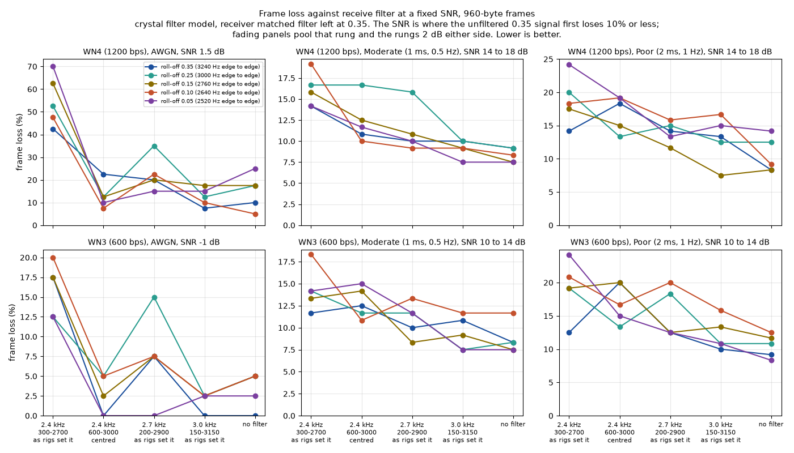
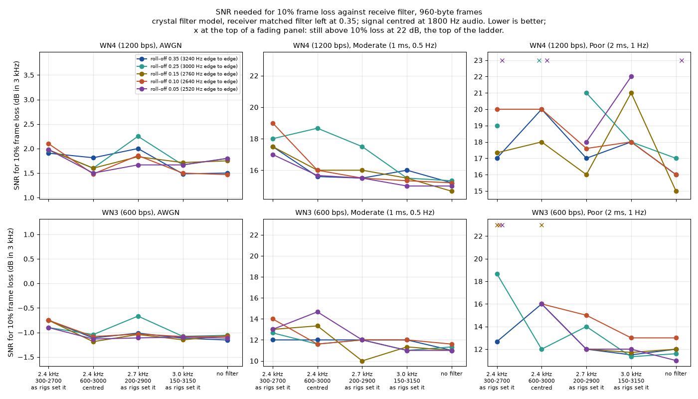
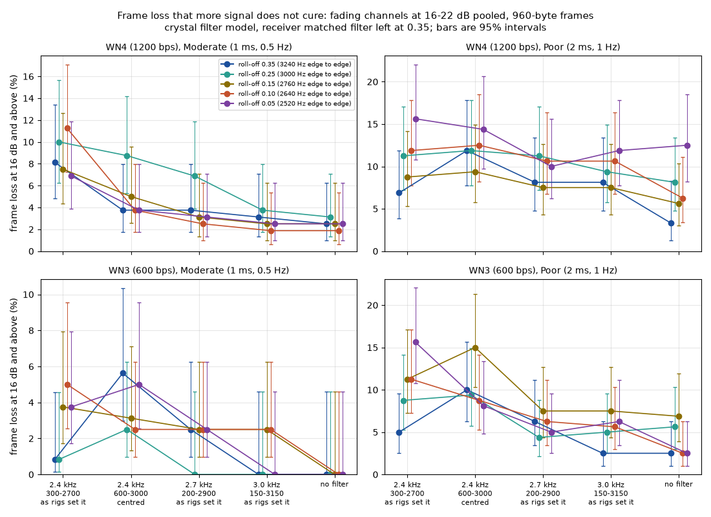

# MS110D through a receiver's SSB filter: what the transmit width costs (2026-10-04)

Status: simulation evidence for pdn-mailcast's filter study (its design doc, "Filter study"). It decides the transmit roll-off for GB7RDG's 40 m bulletin transmissions and checks the dial.

## The answer

- **Keep the transmit roll-off at the standard's 0.35.** Narrowing it never helped any receiver we modelled. On a steady signal it made no difference at all, and on the fading channels, through a 2.4 kHz filter, frame loss got worse as the signal got narrower: WN4 lost 21% of its frames at 0.35 and 30% at 0.05 (Poor, 960-byte frames, 10 to 22 dB).
- **Leave the receiver alone.** Matching its filter to a narrower transmitter changed nothing measurable: 13.5% against 13.5% frame loss pooled over every fading point.
- **A 2.4 kHz rig pays about half a dB on a steady signal and 1 to 2 dB when the path fades** (WN4; about 1 dB for WN3), plus a few percent of frames that no amount of signal brings back. 2.7 and 3.0 kHz filters cost between nothing and 1 dB, mostly about half a dB, which is at the edge of what these runs can resolve.
- **The dial is right: 7.0497 MHz USB, signal centred on 1800 Hz audio.** Moving a 2.4 kHz passband to sit on the signal helped a DSP rig by up to 1 dB, but made a crystal-filter rig worse on the Poor channel, so it is not worth asking anyone to do.

One thing for the design: on the fading channels frame length matters more than any filter. A 960-byte WN4 frame needs about 16 dB on Poor for 10% loss; a 255-byte one needs about 12.4 dB.

## What was simulated

Each trial renders one IL2P+CRC AX.25 frame with `Ms110dModem` at its native 9600 Hz, puts it through the repository's Watterson rig at a known SNR, filters it with a model of a receiver's SSB filter, and decodes it with a fresh receiver. The frame either comes back bit-exact or it is lost.

- **Transmit roll-off**: 0.35, 0.25, 0.15, 0.10 and 0.05, using the new `Ms110dTxSettings.RollOff`. Edge to edge that is 2400 x (1 + roll-off): 3240, 3000, 2760, 2640 and 2520 Hz.
- **Receiver**: matched filter left at 0.35 (the receiver as shipped), or set to the transmit roll-off with the new `Ms110dDemodOptions.RollOff`.
- **Receive filters**, -6 dB edges in audio, the way rigs quote them: 2.4 kHz (300-2700), 2.7 kHz (200-2900), 3.0 kHz (150-3150), the 2.4 kHz one moved to centre on the signal (600-3000), and no filter. Two shapes:
  - *crystal*: an 8-pole Chebyshev with 0.5 dB ripple, symmetric about its centre as an IF filter is, minimum phase. Shape factor 1.5 (6 to 60 dB), group delay rising from 0.8 ms mid-band to 4 ms at the edges.
  - *DSP*: a 255-tap linear-phase FIR (Kaiser window, about 60 dB stopband), shape factor 1.06, flat group delay.
- **Channels**: AWGN, and the ITU-R F.1487 mid-latitude Moderate (two equal Rayleigh paths, 1 ms apart, 0.5 Hz fading) and Poor (2 ms, 1 Hz), from `SimChannel`/`WattersonChannel`, the same rig the MS110D masks use.
- **SNR**: signal power over noise in 3 kHz, with the noise added before the receive filter, as on air. AWGN in 0.5 dB steps from -3 to 4 dB (then 5 and 6), fading in 2 dB steps from 0 to 22 dB.
- **Modes**: WN4 (1200 bps) and WN3 (600 bps), Short interleaver, K=7, 3 preamble super-frames: the catalogue defaults.
- **Frames**: 960-byte information fields (pdn-mailcast's planned size) for everything, and 255 bytes for a smaller set.

`data/describe.txt` has the realised filter and transmit-spectrum numbers. Through the 2.4 kHz filter as rigs set it, every roll-off loses the same 0.86 dB of signal power: the filter is centred 300 Hz below the signal and cuts 300 Hz off its 2400 Hz core whatever the roll-off, and the roll-off only trims the skirts.

### How many frames, and how sure

40 frames per point, the same 40 seeds at every point, so two configurations differ by their settings and not by the luck of the draw. A point whose first 5 frames are all lost stops at 5, and a ladder stops once two rungs in a row lose nothing. 111,000 frames in all, over 4,016 points; about 5 hours on 8 cores of a shared box.

At 10% loss a single 40-frame point has a 95% interval of 4 to 23%, so read single points as rough. The AWGN thresholds are good to about 0.3 dB (the cliff is under a dB wide). The fading thresholds are only good to 1 to 1.5 dB, because the loss curves flatten out near 10%; that is why the tables also give the loss pooled over 10 to 22 dB, which rests on 280 frames (plus or minus about 4 points at 15%).

## Results

### Each filter at roll-off 0.35, receiver unchanged

AWGN cells are the SNR (dB in 3 kHz) for 10% frame loss. Fading cells are that SNR, then the frame loss pooled over 10 to 22 dB. `>22` means the loss was still above 10% at the top of the ladder.

960-byte frames:

| mode, channel | no filter | xtal 3.0 | xtal 2.7 | xtal 2.4 | xtal 2.4 centred | dsp 3.0 | dsp 2.7 | dsp 2.4 | dsp 2.4 centred |
|---|---|---|---|---|---|---|---|---|---|
| WN4, AWGN | 1.5 | 1.5 | 2.0 | 1.9 | 1.8 | 1.6 | 1.8 | 2.3 | 1.9 |
| WN4, Moderate | 15.2 / 12% | 16.0 / 12% | 15.5 / 13% | 17.5 / 17% | 15.6 / 14% | 15.5 / 12% | 16.0 / 14% | 17.0 / 16% | 16.0 / 14% |
| WN4, Poor | 16.0 / 16% | 18.0 / 16% | 17.0 / 21% | 17.0 / 21% | 20.0 / 23% | 16.0 / 15% | 16.0 / 18% | 17.6 / 19% | 17.3 / 16% |
| WN3, AWGN | -1.2 | -1.1 | -1.0 | -0.8 | -1.1 | -1.1 | -1.0 | -0.6 | -1.0 |
| WN3, Moderate | 11.0 / 5% | 12.0 / 6% | 12.0 / 6% | 12.0 / 6% | 12.0 / 9% | 11.0 / 5% | 11.2 / 5% | 12.0 / 7% | 11.0 / 4% |
| WN3, Poor | 12.0 / 5% | 11.5 / 6% | 12.0 / 9% | 12.7 / 8% | 16.0 / 14% | 12.7 / 6% | 12.7 / 8% | 12.7 / 9% | 12.0 / 8% |

255-byte frames (crystal only):

| mode, channel | no filter | xtal 2.4 | xtal 2.4 centred |
|---|---|---|---|
| WN4, AWGN | 1.6 | 1.9 | 1.5 |
| WN4, Moderate | 12.0 / 6% | 13.5 / 10% | 14.0 / 10% |
| WN4, Poor | 12.4 / 9% | 14.7 / 13% | >22 / 18% |
| WN3, AWGN | -1.3 | -1.1 | -1.5 |
| WN3, Moderate | 8.7 / 0% | 8.7 / 2% | 8.0 / 0% |
| WN3, Poor | 10.0 / 4% | 12.0 / 10% | 14.0 / 11% |

### Each roll-off through the 2.4 kHz crystal filter (300-2700)

960-byte frames; each cell is "receiver unchanged ; receiver matched", same units as above.

| mode, channel | 0.35 | 0.25 | 0.15 | 0.10 | 0.05 |
|---|---|---|---|---|---|
| WN4, AWGN | 1.9 | 2.0 ; 2.0 | 2.0 ; 2.0 | 2.1 ; 2.2 | 2.0 ; 2.0 |
| WN4, Moderate | 17.5 / 17% | 18.0 / 18% ; 18.0 / 19% | 17.5 / 17% ; 17.5 / 18% | 19.0 / 21% ; 18.7 / 21% | 17.0 / 18% ; 16.0 / 17% |
| WN4, Poor | 17.0 / 21% | 19.0 / 26% ; 18.0 / 24% | 17.3 / 25% ; 19.0 / 28% | 20.0 / 26% ; >22 / 30% | >22 / 30% ; >22 / 32% |
| WN3, AWGN | -0.8 | -0.9 ; -1.0 | -0.8 ; -0.7 | -0.8 ; -0.8 | -0.9 ; -1.0 |
| WN3, Moderate | 12.0 / 6% | 12.7 / 8% ; 14.0 / 8% | 13.0 / 8% ; 12.0 / 8% | 14.0 / 11% ; 15.3 / 12% | 13.0 / 8% ; 13.0 / 8% |
| WN3, Poor | 12.7 / 8% | 18.7 / 13% ; >22 / 15% | >22 / 15% ; >22 / 15% | >22 / 15% ; >22 / 18% | >22 / 19% ; >22 / 19% |

The same table for no filter and for the centred filter, and every other configuration, is in `thresholds.csv`; `analyze.py` prints them all.

### Charts

The main chart: frame loss against receive filter at a fixed SNR, one line per transmit roll-off.



The SNR needed for 10% frame loss against receive filter:



The loss that more signal does not cure, fading channels at 16 to 22 dB:



Every chart is in `charts/` as PNG and SVG: `loss-`, `snr10-` and `floor-` for the crystal model with the receiver unchanged (`xtal-standard`) and matched (`xtal-matched`), the DSP model (`dsp-standard`), and the 255-byte frames (`xtal-standard-255B`).

## Reading it

**Why a narrower signal does not help.** MS110D sends 2400 symbols a second, so its core is 2400 Hz wide whatever the roll-off; the roll-off only sets how far the skirts reach beyond that. The usual 2.4 kHz filter sits at 300 to 2700 Hz, centred 300 Hz below our signal, so it cuts 300 Hz off the core at the top. Narrowing the skirts cannot give that back. What it does do is make the pulse ring for longer, and on the fading channels the receiver copes visibly worse with that: the narrow roll-offs lose more frames on Poor, with or without a filter.

**Why the receiver need not change.** Its equaliser already absorbs the mismatch between a narrow transmitter and its own 0.35 matched filter. Matching the filter gave the same loss everywhere, within the noise.

**Why the dial stays.** Centring a 2.4 kHz passband on the signal (passband tuning on the rig, or a dial 300 Hz higher with the modem's centre moved to match) puts both of the signal's edges on the filter's edges instead of one. With a DSP filter that is a small win, up to about 1 dB. With a crystal filter both edges then sit in its group-delay peaks, and on Poor that cost more than the centring gained (WN4 17.0 to 20.0 dB, WN3 12.7 to 16.0 dB). So there is no single better dial to tell people, and 7.0497 MHz USB, with the signal at the standard's 1800 Hz, stands. The useful advice to receiving stations is simpler: use the widest SSB filter the rig has, ideally 2.7 kHz or more.

**Does 0.35 fit the segment?** Centred on 7.0515 MHz, 99% of its power sits in 7.0501 to 7.0529 MHz, but its outermost skirts run from 7.04988 to 7.05312 MHz, 120 Hz past each end of 7.050 to 7.053. Roll-off 0.25 is exactly 3000 Hz edge to edge, so if the band plan is read edge to edge, 0.25 is the fallback. Without a filter it costs nothing measurable on AWGN or Moderate and about 1 dB at the WN4 Poor threshold (with the same pooled loss); through a 2.4 kHz filter on Poor it loses about 5 points more frames than 0.35.

**Frame length.** These runs used the Short interleaver, and a 960-byte WN4 frame is an 8-second burst (WN3 15 seconds): on a 1 Hz fade that is plenty of time to meet a deep one. Without any filter, 960-byte frames need 2 to 3.5 dB more SNR than 255-byte frames for 10% loss on the fading channels. WN3 at 960 bytes does better than WN4 by about 4 dB for half the speed. The Long interleaver was not tried here and may be worth a look before the frame size is fixed.

## Limits

Simulation only: no real rig, no AGC, no audio-stage filtering beyond the IF filter, no frequency offset. The crystal model is one reasonable 8-pole design; real filters vary, and some have more group-delay ripple. Filters are placed where rigs commonly put them, but rigs differ by a hundred hertz or so.

## Reproduce

From the repository root:

```sh
dotnet build tools/Packet.SoundModem.Ota -c Release
sh docs/dev/ms110d/evidence/2026-10-04-filter-width/run.sh      # all three sweeps; resumes if interrupted
python3 docs/dev/ms110d/evidence/2026-10-04-filter-width/analyze.py   # needs matplotlib
```

`run.sh 1`, `2` or `3` runs one sweep: the main crystal sweep, the DSP filters (roll-offs 0.35 and 0.05, receiver unchanged), or the 255-byte frames. `sm-ota filter-study --help` lists every option, and `--describe` prints the filter and spectrum figures. The sweeps here ran at revision 78e57f1 plus the descriptive-text change in this branch.

| file | what it is |
|---|---|
| `data/main-960B.csv`, `data/dsp-960B.csv`, `data/short-255B.csv` | every point: configuration, SNR, frames run and lost, Wilson 95% interval |
| `data/describe.txt` | the realised filters and transmit spectra |
| `thresholds.csv` | per configuration: SNR for 10% loss and the 16 to 22 dB loss with its interval |
| `analyze.py` | makes `thresholds.csv`, the charts and the tables above |
| `run.sh` | the sweeps exactly as run |
